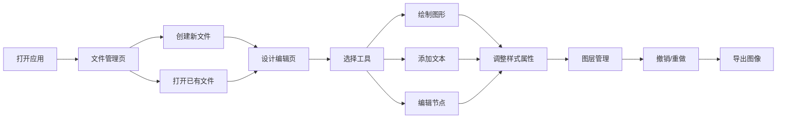

## 1. 产品概述

Design Studio 是一款功能强大的在线矢量设计工具，提供完整的图形绘制、文本编辑、图层管理和导出功能，满足设计师和创意工作者的日常设计需求。

- 核心目标：提供轻量、高效、易用的在线设计体验，无需安装专业软件即可完成高质量设计工作
- 目标用户：UI设计师、平面设计师、产品经理、创意工作者、学生

## 2. 核心功能

### 2.1 用户角色

| 角色 | 注册方式 | 核心权限 |
|------|----------|----------|
| 普通用户 | 本地存储 | 创建、编辑、保存、导出设计文件 |

### 2.2 功能模块

1. **文件管理页面**：文件列表、创建新文件、最近文件、收藏文件
2. **设计编辑页面**：主画布、工具栏、图层面板、属性面板、导出功能

### 2.3 页面详情

| 页面名称 | 模块名称 | 功能描述 |
|----------|----------|----------|
| 文件管理页 | 文件列表 | 展示所有设计文件，支持搜索、排序、收藏、删除 |
| 文件管理页 | 创建文件 | 输入文件名、选择画板尺寸预设或自定义尺寸 |
| 设计编辑页 | 顶部工具栏 | 撤销/重做、缩放控制、导出按钮、视图切换 |
| 设计编辑页 | 左侧工具栏 | 选择工具、图形绘制工具、文本工具、钢笔/铅笔工具 |
| 设计编辑页 | 中间画布区 | 多画板支持、标尺网格、缩放平移、智能参考线 |
| 设计编辑页 | 右侧图层面板 | 图层树形结构、隐藏/锁定、分组、顺序调整 |
| 设计编辑页 | 右侧属性面板 | 填充、描边、阴影、模糊、圆角、不透明度等样式设置 |
| 设计编辑页 | 底部状态栏 | 鼠标坐标、选中信息、缩放比例 |

## 3. 核心流程

## 4. 用户界面设计

### 4.1 设计风格

- **主色调**：深紫色 (#6366f1) 作为主色，代表创意与专业
- **辅助色**：亮青色 (#06b6d4) 用于交互元素强调
- **中性色**：深色背景 (#0f172a)、深灰面板 (#1e293b)、浅灰文本 (#94a3b8)、高亮文本 (#f1f5f9)
- **按钮风格**：圆角中等 (6px)、悬停时有微缩放和阴影效果
- **字体**：
  - 标题：Space Grotesk（现代几何无衬线，兼具科技感）
  - 正文：Inter（清晰易读的界面字体）
- **布局风格**：经典三栏式布局（左工具栏 + 中画布 + 右面板），深色专业设计工具风格
- **图标风格**：简洁线性图标，统一 24px 尺寸，配合深色主题

### 4.2 页面设计概览

| 页面名称 | 模块名称 | UI 元素 |
|----------|----------|----------|
| 文件管理页 | 顶部导航 | 渐变 Logo、搜索框、主题切换按钮 |
| 文件管理页 | 文件网格 | 卡片式布局，悬停时显示操作按钮，缩略图预览 |
| 文件管理页 | 创建模态框 | 表单式设计，尺寸预设快捷选择 |
| 设计编辑页 | 顶部栏 | 半透明玻璃效果，图标按钮组 |
| 设计编辑页 | 左侧工具栏 | 垂直图标按钮，选中状态高亮，工具提示 |
| 设计编辑页 | 画布区域 | 无限画布，棋盘格背景，画板带阴影 |
| 设计编辑页 | 右侧面板 | 可折叠面板组，滑块、颜色选择器、下拉菜单 |

### 4.3 响应式设计

- **桌面端优先**：完整功能和三栏布局，支持 1280px 及以上宽度
- **平板适配**：右侧面板可折叠收起，工具栏保持
- **移动端**：仅保留核心画布功能，工具栏转为底部浮动

### 4.4 交互与动画

- 画布缩放：平滑过渡动画
- 工具切换：图标颜色渐变过渡
- 面板展开/收起：高度过渡动画
- 拖拽元素：实时位置反馈，智能参考线瞬时显示
- 文件保存：右下角 Toast 通知，淡入淡出
