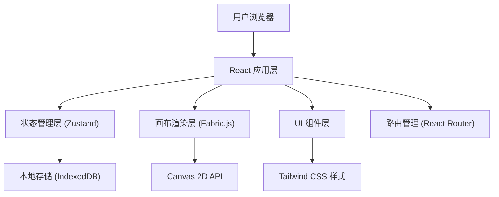

## 1. 架构设计



## 2. 技术选型

- **前端框架**：React@18 + TypeScript
- **构建工具**：Vite@5
- **样式方案**：TailwindCSS@3
- **画布引擎**：Fabric.js@5（矢量图形渲染核心）
- **状态管理**：Zustand（轻量级状态管理）
- **路由管理**：React Router@6
- **本地存储**：IndexedDB + LocalForage（大文件存储）
- **图标库**：Lucide React
- **导出功能**：html2canvas / fabric.js 内置导出

## 3. 目录结构

```
src/
├── components/
│   ├── editor/
│   │   ├── Canvas.tsx          # 画布主组件
│   │   ├── Toolbar.tsx         # 左侧工具栏
│   │   ├── TopBar.tsx          # 顶部栏
│   │   ├── LayerPanel.tsx      # 图层面板
│   │   ├── PropertyPanel.tsx   # 属性面板
│   │   └── StatusBar.tsx       # 底部状态栏
│   ├── home/
│   │   ├── FileList.tsx        # 文件列表
│   │   ├── FileCard.tsx        # 文件卡片
│   │   └── CreateModal.tsx     # 创建文件模态框
│   └── ui/                     # 通用UI组件
├── hooks/
│   ├── useCanvas.ts            # 画布操作Hook
│   ├── useHistory.ts           # 历史记录Hook
│   └── useKeyboard.ts          # 快捷键Hook
├── store/
│   ├── canvasStore.ts          # 画布状态
│   ├── fileStore.ts            # 文件状态
│   └── uiStore.ts              # UI状态
├── types/
│   └── index.ts                # 类型定义
├── utils/
│   ├── canvasUtils.ts          # 画布工具函数
│   ├── exportUtils.ts          # 导出工具
│   └── storage.ts              # 存储工具
├── pages/
│   ├── Home.tsx                # 首页/文件管理
│   └── Editor.tsx              # 编辑器页面
├── App.tsx
└── main.tsx
```

## 4. 路由定义

| 路由 | 页面 | 功能 |
|------|------|------|
| `/` | 首页 | 文件管理、创建新文件 |
| `/editor/:id` | 编辑器 | 设计编辑主界面 |

## 5. 核心数据模型

### 5.1 设计文件数据结构

```typescript
interface DesignFile {
  id: string;
  name: string;
  thumbnail: string;
  createdAt: number;
  updatedAt: number;
  isFavorite: boolean;
  artboards: Artboard[];
  width: number;
  height: number;
}

interface Artboard {
  id: string;
  name: string;
  x: number;
  y: number;
  width: number;
  height: number;
  layers: Layer[];
  backgroundColor: string;
}

interface Layer {
  id: string;
  type: 'rect' | 'circle' | 'polygon' | 'line' | 'text' | 'path' | 'group';
  name: string;
  visible: boolean;
  locked: boolean;
  x: number;
  y: number;
  width: number;
  height: number;
  rotation: number;
  opacity: number;
  blendMode: string;
  fill: FillStyle;
  stroke: StrokeStyle;
  shadow: ShadowStyle;
  radius: number | number[];
  children?: Layer[];
}

interface FillStyle {
  type: 'solid' | 'linear-gradient' | 'radial-gradient' | 'image' | 'none';
  color?: string;
  gradientStops?: { color: string; offset: number }[];
  gradientAngle?: number;
  imageUrl?: string;
}

interface StrokeStyle {
  enabled: boolean;
  color: string;
  width: number;
  dashArray?: number[];
  lineCap: 'butt' | 'round' | 'square';
  lineJoin: 'miter' | 'round' | 'bevel';
}

interface ShadowStyle {
  enabled: boolean;
  type: 'drop' | 'inner';
  color: string;
  offsetX: number;
  offsetY: number;
  blur: number;
  spread: number;
}
```

### 5.2 历史记录模型

```typescript
interface HistoryState {
  past: string[];      // JSON snapshots
  present: string;
  future: string[];
  maxHistory: number;
}
```

## 6. 核心交互流程

### 6.1 画布操作

1. **选择工具**：点击图层选中 → 显示变换框 → 拖拽/缩放/旋转
2. **绘制工具**：选择图形 → 鼠标按下起点 → 拖拽绘制 → 鼠标松开完成
3. **钢笔工具**：点击创建锚点 → 拖拽创建贝塞尔手柄 → 点击连接或双击结束
4. **文本工具**：点击或拖拽创建文本框 → 输入文本 → 失焦完成

### 6.2 快捷键支持

| 快捷键 | 功能 |
|--------|------|
| `Ctrl+Z` | 撤销 |
| `Ctrl+Shift+Z` | 重做 |
| `Ctrl+C/V` | 复制/粘贴 |
| `Delete/Backspace` | 删除选中 |
| `Ctrl+A` | 全选 |
| `Ctrl+G` | 分组 |
| `Ctrl+Shift+G` | 解组 |
| `Ctrl+[` / `Ctrl+]` | 图层后移/前移 |
| `Space + 拖拽` | 平移画布 |
| `Ctrl + 滚轮` | 缩放画布 |
| `V` | 选择工具 |
| `R` | 矩形工具 |
| `O` | 椭圆工具 |
| `T` | 文本工具 |
| `P` | 钢笔工具 |
| `H` | 手型工具 |
